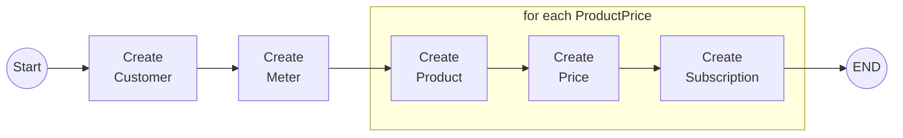
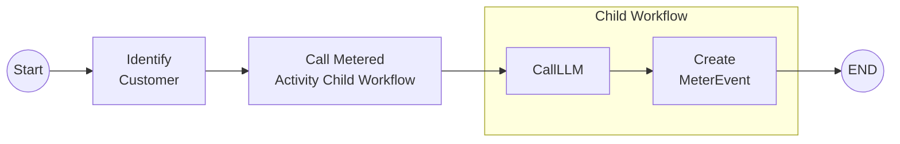

# Dapr Workflow with Stripe

This repo contains two Dapr applications that demonstrate how to use the [Dapr Workflow](https://docs.dapr.io/developing-applications/building-blocks/workflow/workflow-overview/) API to write workflows as code to orchestrate calls to other services that include Stripe.

For instance you are building a SaaS product that calls out to LLM providers and you want to implement [usage based billing](https://stripe.com/en-nl/billing/usage-based-billing) with Stripe for the calls being made to the LLM provider.

---

The `SetupStripeWorkflowApp` demonstrates how to use Dapr Workflow to orchestrate calls to the Stripe API to create a customer, product, price, subscription, and meter.




The `MeteringDemoWorkflowApp` demonstrates how to use Dapr Workflow to orchestrate a call to a child workflow that contains two activities:

- CallLLM: calls an LLM using the Dapr Conversation API
- CreteMeterEvent: creates a Stripe meter event



## Running locally

### 1a. Pre-requisites to use this repo with the devcontainer

- [Docker Desktop](https://www.docker.com/products/docker-desktop)
- [VSCode](https://code.visualstudio.com/)
- [DevContainers](https://marketplace.visualstudio.com/items?itemName=ms-vscode-remote.remote-containers) Extension for VSCode

The devcontainer configuration that is included in this repo contains the .NET SDK, installs the Dapr CLI, and initializes Dapr.

### 1b. Pre-requisites to use this repo without a devcontainer

- [Docker Desktop](https://www.docker.com/products/docker-desktop)
- [.NET 8 SDK](https://dotnet.microsoft.com/download/dotnet/8.0)
- [Dapr CLI](https://docs.dapr.io/getting-started/install-dapr-cli/)
- [Initialize Dapr](https://docs.dapr.io/getting-started/install-dapr-selfhost/)

### 1c. Accounts required

To run this demo end-to-end you need accounts for:
- [Stripe](https://stripe.com/)
- [Anthropic](https://anthropic.com/)

### 2. Create a Stripe API key and set it as a secret

See the Stripe [docs](https://docs.stripe.com/keys) on how to generate an API key.

The `SetupStripeWorkflowApp` uses the Dapr Secrets API and to read the Stripe key from a local file named `secrets.json`.

Rename the `secrets.json.temp` file located in the Resources folder to `secrets.json` and add the Stripe API key to the `stripeKey` field.

```bash
{
    "stripeKey": "sk_test_***",
    "anthropicKey" : ""
}
```

### 3. Run the `SetupStripeWorkflowApp` application

Open a terminal in the root of the repository and start the `SetupStripeWorkflowApp` application using the Dapr CLI:

```bash
dapr run --app-id setup-app --resources-path ./Resources --app-port 5253 --dapr-http-port 3516 -- dotnet run --project ./SetupStripeWorkflowApp/
```

## 4. Starting the `SetupStripeWorkflow`

If you're using the devcontainer, open the [setupstripe.http](setupstripe.http) file and use the REST Client extension to make a request to the `SetupStripeWorkflowApp`.

Once you've made the request and verified the workflow has completed successfully, you can stop the `SetupStripeWorkflowApp`.

## 5. Create an API key for the Anthropic and set it as a secret

Log into Antropic and create a new [API key](https://console.anthropic.com/settings/keys).

Locate the `secrets.json` file in the Resources folder and add the Anthropic API key to the `anthropicKey` field.

```bash
{
    "stripeKey": "sk_test_***",
    "anthropicKey" : "sk-ant-api03-***"
}
```

## 6. Run the `MeteringDemoWorkflowApp` application

Open a terminal in the root of the repository and start the `MeteringDemoWorkflowApp` application using the Dapr CLI:

```bash
dapr run --app-id meter-app --resources-path ./Resources --app-port 5255 --dapr-http-port 3518 -- dotnet run --project ./MeteringDemoWorkflowApp/
```

## 7. Starting the `MeteredActivityWorkflow`

If you're using the devcontainer, open the [meterdemo.http](meterdemo.http) file and use the REST Client extension to make a request to the `MeteredActivityWorkflowApp`.

Once you've made the request and verified the workflow has completed successfully, you can stop the `MeteredActivityWorkflowApp`.